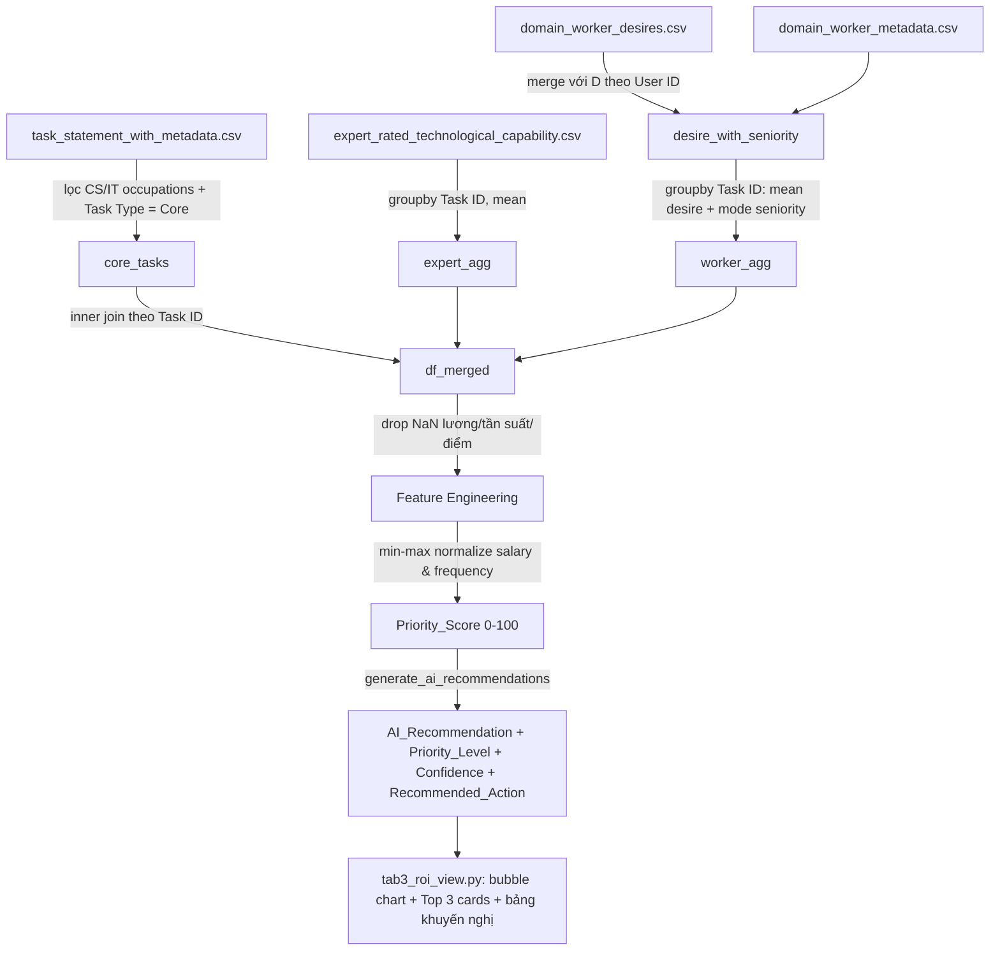
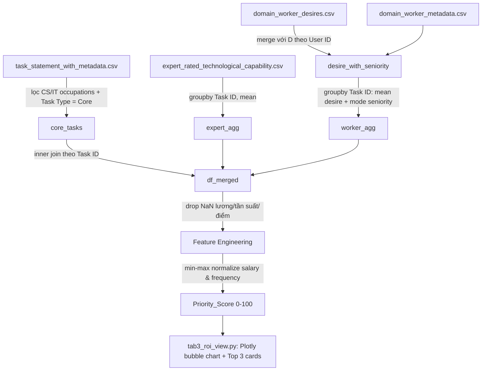

# 📊 AI Agent CS Strategy & Analytics Dashboard

> Hệ thống Hỗ trợ Ra Quyết định (**Decision Support System — DSS**) giúp doanh nghiệp **ưu tiên hóa ngân sách tự động hóa AI Agent** cho các vị trí ngành Khoa học máy tính / CNTT, dựa trên dữ liệu O*NET (Mỹ) về mức lương, tần suất tác vụ, năng lực công nghệ và mức độ ủng hộ của người lao động.

Xây dựng bằng **Streamlit + Plotly**, dashboard trả lời câu hỏi cốt lõi:# 📊 AI Agent CS Strategy & Analytics Dashboard

> Hệ thống Hỗ trợ Ra Quyết định (**Decision Support System — DSS**) giúp doanh nghiệp **ưu tiên hóa ngân sách tự động hóa AI Agent** cho các vị trí ngành Khoa học máy tính / CNTT — kết hợp xếp hạng điểm ưu tiên đa yếu tố với một **bộ máy khuyến nghị dựa trên luật (rule-based AI)** tự động đề xuất hành động cụ thể cho từng tác vụ.

Xây dựng bằng **Streamlit + Plotly**, dashboard trả lời 2 câu hỏi cốt lõi:

> 1. *"Trong hàng trăm tác vụ mà nhân sự CNTT đang làm, nên ưu tiên đầu tư AI Agent vào đâu trước?"*
> 2. *"Với từng tác vụ cụ thể, nên làm ngay, thử nghiệm, đào tạo thêm hay chưa nên động vào — và bước tiếp theo là gì?"*

---

## 🎯 Bài toán & Động lực

Nhiều tổ chức khi triển khai AI Agent thường mắc sai lầm phổ biến: **chỉ nhìn vào lương** — tự động hóa các vị trí lương cao nhất trước vì tưởng ROI sẽ lớn nhất. Vấn đề là lương cao không đồng nghĩa AI *làm được* việc đó, và cũng không đồng nghĩa nhân sự *sẵn sàng* giao việc đó cho AI.

Dự án xây dựng một **Điểm Ưu Tiên (Priority Score) đa yếu tố** (25% mỗi yếu tố: lương, tần suất, năng lực công nghệ, mức ủng hộ nhân sự) để xếp hạng, **sau đó** dùng một **bộ máy khuyến nghị riêng** để trả lời câu hỏi hành động: *nên làm gì với từng tác vụ, và làm như thế nào*.

| Yếu tố | Ý nghĩa | Dùng để làm gì |
|---|---|---|
| 💰 Giá trị kinh tế (Salary) | Lương trung bình của nghề | Xếp hạng độ ưu tiên (Priority Score) |
| 🔁 Tần suất (Frequency) | Tác vụ lặp lại thường xuyên đến đâu | Xếp hạng độ ưu tiên (Priority Score) |
| 🤖 Năng lực công nghệ (Tech Feasibility) | Chuyên gia đánh giá AI có làm được không | Xếp hạng **và** phân loại hành động |
| 🙋 Mức ủng hộ nhân sự (Worker Support) | Chính người làm task có muốn giao cho AI không | Xếp hạng **và** phân loại hành động |

---

## 🖥️ Dashboard hiển thị gì?

Ứng dụng hiện hiển thị **Phân Hệ 3: Tối Ưu Hóa ROI Điều Chỉnh Theo Rủi Ro**, gồm 3 phần:

1. **Bản Đồ Phân Bổ Ngân Sách Đầu Tư** — biểu đồ bong bóng Plotly (trục X: tần suất, trục Y: lương, kích thước: Priority Score, màu: Senior/Junior).
2. **Khuyến Nghị Hành Động Chiến Lược** — Top 3 tác vụ điểm cao nhất, mỗi thẻ hiện: Mức ưu tiên, Độ tin cậy, nhãn khuyến nghị AI, lý do, và **hành động tiếp theo cụ thể**.
3. **🤖 Bộ Máy Khuyến Nghị AI (Rule-based Recommendation Engine)** — mục mới:
   - Hiển thị công khai **các giá trị ngưỡng/tứ phân vị thực tế** đang dùng để phân loại (trung vị α, trung vị β, Q1/Trung vị/Q3 của Priority Score) — minh bạch hóa căn cứ, không phải hộp đen.
   - Thẻ tổng hợp số lượng tác vụ theo từng nhãn khuyến nghị.
   - Bộ lọc kép: theo nhãn khuyến nghị và theo độ tin cậy.
   - Bảng chi tiết đầy đủ: tác vụ, nghề, thâm niên, điểm ưu tiên, **mức ưu tiên**, nhãn khuyến nghị, **độ tin cậy**, lý do, **hành động tiếp theo**.

---

## 🏗️ Kiến trúc & Luồng dữ liệu



Pipeline chính nằm trong `load_and_process_roi_data()` (`data_engine.py`):

1. Đọc 4 CSV nguồn (O\*NET-based).
2. Lọc 18 nghề CNTT/KHMT (`CS_OCCUPATIONS`), chỉ tác vụ **Core**.
3. **Gộp trước khi merge**: `expert_rated...csv` và `domain_worker_desires.csv` là dữ liệu cấp **lượt đánh giá** (nhiều người chấm 1 Task ID) — gộp theo `Task ID` bằng trung bình (và mode cho nhãn thâm niên) trước khi inner-join, tránh fan-out.
4. Inner merge → mỗi dòng = 1 Task ID.
5. Loại nghề thiếu `Occupation Mean Annual Wage` gốc, cảnh báo cụ thể nghề nào bị loại.
6. Feature engineering: `Base_ROI`, `Tech_Feasibility_Alpha`, `Worker_Support_Beta`, min-max `Salary_Index`/`Frequency_Index`, `Priority_Score`, `Adjusted_ROI`.
7. **Gọi `generate_ai_recommendations(df)`** → trả về `(df, thresholds)` — xem chi tiết ở mục kế tiếp.
8. Đổi tên cột, sắp xếp giảm dần theo `Priority_Score`.

> ⚠️ **Lưu ý kỹ thuật quan trọng:** `load_and_process_roi_data()` giờ trả về **tuple** `(roi_data, thresholds)` thay vì chỉ 1 DataFrame. Nếu có thêm file nào khác gọi hàm này, cần cập nhật cách gọi tương ứng (`data, thresholds = load_and_process_roi_data()`).

---

## 🧮 Phương pháp luận

### A. Điểm Ưu Tiên (Priority Score) — dùng để xếp hạng

```
Tech_Feasibility_Alpha = expert_score / 5
Worker_Support_Beta    = worker_support / 5
Salary_Index    = min-max(salary)      # chuẩn hóa trong tập dữ liệu đang xét
Frequency_Index = min-max(frequency)

Priority_Score = 100 × (0.25×Salary_Index + 0.25×Frequency_Index
                       + 0.25×Tech_Feasibility_Alpha + 0.25×Worker_Support_Beta)
```

**Vì sao chuẩn hóa + trung bình cộng thay vì nhân trực tiếp USD?** Lương dao động ~36.000–360.000 USD trong khi Alpha/Beta chỉ nằm trong [0,1]. Nhân trực tiếp sẽ khiến lương áp đảo toàn bộ kết quả, quay lại đúng sai lầm ban đầu — chọn tự động hóa theo lương. Chuẩn hóa + trung bình cộng đảm bảo mỗi yếu tố đóng góp đúng 25%.

`Base_ROI` (USD) và `Adjusted_ROI` (USD) vẫn được giữ lại và hiển thị (hover, thẻ khuyến nghị) để tham khảo quy mô kinh tế tuyệt đối, **nhưng không dùng để xếp hạng**.

### B. Bộ Máy Khuyến Nghị AI — dùng để quyết định hành động

Đây là phần **tách biệt** khỏi Priority Score, trả lời câu hỏi khác: *"có nên làm, và làm như thế nào"* — chỉ dựa trên 2 trục: **Năng lực công nghệ** (AI có làm được không) và **Mức ủng hộ nhân sự** (người ta có muốn không). Lương và tần suất **không** tham gia bước này, vì chúng trả lời câu hỏi "đáng giá bao nhiêu tiền" — câu hỏi đã được Priority Score xử lý.

**Ma trận 2×2** (ngưỡng "cao/thấp" = **trung vị** của chính tập dữ liệu, tính động bằng `df['Tech_Feasibility_Alpha'].median()` — không hardcode số cố định):

| | Worker Support **cao** | Worker Support **thấp** |
|---|---|---|
| Tech Feasibility **cao** | 🚀 Nên làm ngay | Senior → 🧪 Thử nghiệm thận trọng<br>Junior → 🎓 Cần đào tạo thêm |
| Tech Feasibility **thấp** | 🧪 Thử nghiệm | ⛔ Chưa nên tự động hóa |

**Vì sao ô "Công nghệ cao + Ủng hộ thấp" lại tách theo thâm niên?** Đây là ô "máy làm được, người không muốn" — lý do phản đối rất khác nhau tùy thâm niên: Senior phản đối thường vì hiểu rõ rủi ro thực tế (đáng tôn trọng, nên thử nghiệm thận trọng); Junior phản đối thường vì thiếu thông tin/lo sợ (nên đào tạo trước, không phải hủy kế hoạch).

### C. Ba lớp thông tin bổ sung — làm khuyến nghị cụ thể hơn

1. **Priority_Level** (Thấp / Trung bình / Cao / Rất cao): chia tứ phân vị (Q1/Trung vị/Q3) của `Priority_Score` — cho biết mức độ ưu tiên tương đối trong toàn bộ danh sách.

2. **Confidence — Độ tin cậy** (Thấp / Trung bình / Cao): đo **khoảng cách Euclid** từ vị trí (α, β) của từng task tới điểm ngưỡng (α_trung vị, β_trung vị):
   ```
   distance = sqrt((α_task − α_ngưỡng)² + (β_task − β_ngưỡng)²)
   ```
   Task có khoảng cách **lớn** (nằm rõ ràng sâu trong 1 góc phần tư) → **Độ tin cậy Cao** — nhãn khuyến nghị chắc chắn. Task có khoảng cách **nhỏ** (α hoặc β chỉ nhỉnh hơn/kém ngưỡng một chút, gần như nằm ngay ranh giới 2 nhóm) → **Độ tin cậy Thấp** — chỉ cần lệch nhẹ (thêm vài người chấm điểm khác) là có thể đổi nhãn, nên cần xem xét thủ công thay vì tin tuyệt đối.

3. **Recommended_Action**: hành động cụ thể tiếp theo cho từng nhãn (mốc thời gian, ai phụ trách) — ví dụ nhãn "🚀 Nên làm ngay" đi kèm gợi ý *"Đề xuất phân bổ ngân sách Quý tới, phân công Trưởng nhóm kỹ thuật phụ trách, thời gian dự kiến 4-6 tuần"*.

Toàn bộ 2 lớp Priority_Level và Confidence dùng hàm `_safe_qcut()` — nếu dữ liệu quá ít/trùng lặp khiến không chia đủ số nhóm, tự động rơi về nhãn giữa thay vì crash chương trình.

---

## 📁 Cấu trúc thư mục

```
ai-roi-strategy-dashboard/
├── ccan.py                                    # Entry point Streamlit (chạy: streamlit run ccan.py)
├── data_engine.py                             # Pipeline dữ liệu + generate_ai_recommendations() (rule-based engine)
├── tab3_roi_view.py                           # Giao diện: bubble chart + Top 3 + bảng khuyến nghị AI
├── task_statement_with_metadata.csv           # Danh sách tác vụ theo nghề (O*NET), Frequency, Task Type
├── expert_rated_technological_capability.csv  # Điểm chuyên gia đánh giá khả năng tự động hóa từng Task ID
├── domain_worker_desires.csv                  # Khảo sát mức độ mong muốn tự động hóa (User ID + Task ID)
├── domain_worker_metadata.csv                 # Hồ sơ người lao động (User ID, Experience/thâm niên)
├── requirements.txt                           # Thư viện Python cần thiết
└── README.md
```

> ⚠️ Entry point tên là **`ccan.py`** (không phải `app.py`) — dùng đúng tên này khi chạy `streamlit run`.

---

## 📚 Nguồn dữ liệu (Data Dictionary)

| File | Cấp độ (grain) | Cột quan trọng |
|---|---|---|
| `task_statement_with_metadata.csv` | 1 dòng / Task | `Task ID`, `Occupation (O*NET-SOC Title)`, `Task Type`, `Task`, `Frequency`, `Occupation Mean Annual Wage` |
| `expert_rated_technological_capability.csv` | 1 dòng / lượt chuyên gia chấm | `Task ID`, `Automation Capacity Rating` (1–5) |
| `domain_worker_desires.csv` | 1 dòng / lượt người lao động chấm | `User ID`, `Task ID`, `Automation Desire Rating` (1–5) |
| `domain_worker_metadata.csv` | 1 dòng / người lao động | `User ID`, `Experience` |

**Quy tắc gán thâm niên:**
```python
SENIOR_LEVELS = {'6-10 years', 'More than 10 years'}
# Còn lại → Junior; rỗng/NaN → Unknown
```

---

## 🚀 Cài đặt & Chạy dự án

```bash
git clone https://github.com/phanphongdz1023-pr/ai-roi-strategy-dashboard.git
cd ai-roi-strategy-dashboard

python -m venv venv
source venv/bin/activate        # macOS/Linux
venv\Scripts\activate           # Windows

pip install -r requirements.txt
streamlit run ccan.py
```

Nếu vừa cập nhật code mà giao diện không đổi: dừng hẳn server (`Ctrl+C`), chạy `streamlit cache clear`, rồi `streamlit run ccan.py` lại, và hard-refresh trình duyệt (`Ctrl+Shift+R`).

---

## 🛠️ Công nghệ sử dụng

| Thành phần | Công nghệ |
|---|---|
| Giao diện & tương tác | [Streamlit](https://streamlit.io) |
| Xử lý dữ liệu | [pandas](https://pandas.pydata.org) |
| Trực quan hóa | [Plotly Express](https://plotly.com/python/plotly-express/) |
| Phân loại khuyến nghị | Rule-based engine tự viết (median-split + tứ/tam phân vị bằng `pandas.qcut`) |
| Caching | `st.cache_data` |

---

## 💡 Insight chính (dùng khi thuyết trình)

1. **Không nên tự động hóa theo lương** — Priority Score chuẩn hóa 4 yếu tố ngang nhau để sửa lỗi này.
2. **Priority Score trả lời "ưu tiên cái gì"; Bộ máy khuyến nghị trả lời "làm gì với nó"** — hai câu hỏi tách biệt, dùng đúng tiêu chí cho từng câu hỏi.
3. **Độ tin cậy giúp phân biệt "chắc chắn nên làm" với "tạm nghiêng về nên làm"** — quan trọng khi phải giải trình quyết định, tránh tin tuyệt đối vào các task nằm sát ranh giới phân loại.
4. **Task của Senior phản đối ≠ Task của Junior phản đối** — cùng là "công nghệ khả thi nhưng bị phản đối", nhưng hướng xử lý khác nhau hoàn toàn (thử nghiệm thận trọng vs. đào tạo thêm).
5. **Mọi ngưỡng phân loại đều hiển thị công khai trên dashboard** — không phải hộp đen; người xem thấy được chính xác con số nào quyết định một task rơi vào nhóm nào.

---

## ⚠️ Giới hạn hiện tại & Hướng phát triển

- Dashboard hiện chỉ có **Phân Hệ 3 (ROI)**; các phân hệ khác trong kế hoạch tổng thể DSS (ví dụ Guardrails — đối chiếu mức độ không chắc chắn công nghệ với mối lo ngại đạo đức) chưa được tích hợp vào `ccan.py`.
- Trọng số 25%-25%-25%-25% của Priority Score là giả định cố định — có thể mở rộng thành slider tùy chỉnh để lãnh đạo tự điều chỉnh theo ưu tiên chiến lược từng giai đoạn.
- Bộ máy khuyến nghị hiện là rule-based (median-split); có thể nâng cấp lên clustering (KMeans) hoặc mô hình học máy có giám sát nếu có dữ liệu nhãn thực tế (task nào đã tự động hóa thành công/thất bại) để đối chiếu.
- Một số nghề bị loại do thiếu `Occupation Mean Annual Wage` gốc từ O*NET — nên bổ sung nguồn lương thay thế (vd. BLS OEWS) để tăng độ phủ.

---

## 📄 License

Dự án phục vụ mục đích học thuật / thuyết trình. Vui lòng bổ sung giấy phép phù hợp (MIT, Apache 2.0...) nếu muốn công khai sử dụng lại.

## 👤 Tác giả

**phanphongdz1023-pr** — [GitHub](https://github.com/phanphongdz1023-pr)

> *"Trong hàng trăm tác vụ (task) mà nhân sự CNTT đang làm mỗi ngày, nên tự động hóa cái nào trước để vừa tối ưu chi phí, vừa khả thi về công nghệ, vừa không gây phản kháng nội bộ?"*

---

## 🎯 Bài toán & Động lực

Nhiều tổ chức khi triển khai AI Agent thường mắc phải sai lầm phổ biến: **chỉ nhìn vào lương** — tự động hóa các vị trí lương cao nhất trước vì tưởng ROI (Return on Investment) sẽ lớn nhất.

Dự án này chứng minh cách tiếp cận đó là thiếu sót, bằng cách xây dựng một **Điểm Ưu Tiên (Priority Score) đa yếu tố**, kết hợp cân bằng 4 chiều:

| Yếu tố | Ý nghĩa | Nguồn dữ liệu |
|---|---|---|
| 💰 **Giá trị kinh tế (Salary)** | Mức lương trung bình của nghề càng cao → tiềm năng tiết kiệm càng lớn | O*NET Wage data |
| 🔁 **Tần suất tác vụ (Frequency)** | Tác vụ càng lặp lại thường xuyên → tự động hóa càng hiệu quả | O*NET Task Frequency |
| 🤖 **Năng lực công nghệ (Tech Feasibility)** | Chuyên gia đánh giá AI hiện tại có làm được tác vụ này không | Expert-rated automation capability |
| 🙋 **Mức ủng hộ của người lao động (Worker Support)** | Chính nhân sự đang làm task đó có muốn giao nó cho AI không | Worker survey (desire to automate) |

Việc **chuẩn hóa và gộp 4 yếu tố với trọng số ngang nhau (25% mỗi yếu tố)** — thay vì nhân trực tiếp số USD với các hệ số — là điểm kỹ thuật cốt lõi giúp dashboard này tránh được thiên lệch "lương cao thắng tuyệt đối" (chi tiết ở mục [Phương pháp luận](#-phương-pháp-luận-công-thức-tính-priority-score)).

---

## 🖥️ Dashboard hiển thị gì?

Ứng dụng hiện tại chỉ hiển thị **Phân Hệ 3: Tối Ưu Hóa ROI Điều Chỉnh Theo Rủi Ro**, gồm 2 phần:

1. **Bản Đồ Phân Bổ Ngân Sách Đầu Tư** — biểu đồ bong bóng (bubble chart) Plotly:
   - Trục X: tần suất tác vụ (thang O*NET 3–7)
   - Trục Y: lương trung bình của nghề (USD/năm)
   - Kích thước bong bóng: **Priority Score** (0–100)
   - Màu sắc: cấp bậc nhân sự đa số đã chấm điểm cho task (Senior 🔵 / Junior 🟠 / Unknown ⚪)

2. **Khuyến Nghị Hành Động Chiến Lược** — 3 thẻ (card) hiển thị Top 3 tác vụ có Priority Score cao nhất, kèm insight diễn giải: vì sao ưu tiên task của Senior hơn Junior, và lưu ý phương pháp luận để người xem không hiểu nhầm cột "giá trị kinh tế tuyệt đối" là căn cứ xếp hạng.

---

## 🏗️ Kiến trúc & Luồng dữ liệu



Pipeline được cài đặt trong hàm `load_and_process_roi_data()` (`data_engine.py`), thực hiện tuần tự:

1. **Đọc 4 file CSV nguồn** (O*NET-based): task, expert rating, worker desire, worker metadata.
2. **Lọc phạm vi**: chỉ giữ 18 nghề thuộc lĩnh vực CNTT/KHMT (`CS_OCCUPATIONS`), và chỉ **Task Type = "Core"** (bỏ Supplemental).
3. **Gộp (aggregate) trước khi merge** — bước bắt buộc về mặt kỹ thuật dữ liệu: `expert_rated...csv` và `domain_worker_desires.csv` là dữ liệu ở cấp **lượt đánh giá** (nhiều chuyên gia/người lao động cùng chấm 1 Task ID). Nếu inner-join thẳng mà không gộp trước sẽ gây **fan-out** (nhân bản dòng sai logic).
   - Expert ratings → gộp theo `Task ID`, lấy **trung bình** → `expert_score`.
   - Worker desire → merge với `domain_worker_metadata` qua `User ID` để gắn thâm niên (`Experience`) cho từng lượt chấm, rồi gộp theo `Task ID`: **trung bình** mức ủng hộ + **giá trị xuất hiện nhiều nhất (mode)** của nhãn thâm niên (Senior/Junior).
4. **Inner merge** bảng Core Task với 2 bảng đã gộp ở trên (theo `Task ID`) → mỗi dòng = 1 Task ID duy nhất.
5. **Xử lý dữ liệu thiếu**: một số nghề (vd. *Web Administrators*, *IT Project Managers*) không có `Occupation Mean Annual Wage` trong nguồn O*NET gốc — đây là lỗ hổng dữ liệu nguồn chứ không phải lỗi merge. Các dòng thiếu cột cốt lõi (lương, tần suất, điểm chuyên gia, điểm ủng hộ) bị loại, kèm cảnh báo (`st.warning`) liệt kê nghề nào bị loại và vì sao.
6. **Feature engineering**: tính `Base_ROI`, `Tech_Feasibility_Alpha`, `Worker_Support_Beta`, chuẩn hóa min-max `Salary_Index`/`Frequency_Index`, rồi tính `Priority_Score` và `Adjusted_ROI` (xem công thức chi tiết bên dưới).
7. **Cache**: toàn bộ hàm được decorate bằng `@st.cache_data` để không phải load & tính lại dữ liệu mỗi lần người dùng tương tác với dashboard.

---

## 🧮 Phương pháp luận: Công thức tính Priority Score

### Bước 1 — Quy đổi 2 hệ số về thang [0, 1]

```
Tech_Feasibility_Alpha = expert_score / 5       (thang gốc 1–5)
Worker_Support_Beta    = worker_support / 5     (thang gốc 1–5)
```

### Bước 2 — Chuẩn hóa min-max lương & tần suất (trong phạm vi tập dữ liệu đang xét)

```
Salary_Index    = (salary - min(salary)) / (max(salary) - min(salary))
Frequency_Index = (frequency - min(frequency)) / (max(frequency) - min(frequency))
```

**Vì sao phải chuẩn hóa bước này?** Lương dao động ~36.000–360.000 USD (chênh lệch ~10 lần), trong khi Alpha/Beta chỉ nằm trong [0,1] (chênh lệch tối đa ~6 lần, luôn ≤ 1). Nếu nhân trực tiếp `Base_ROI` (đơn vị USD) với Alpha, Beta, thì **lương gần như quyết định toàn bộ thứ hạng** — dẫn đến hệ quả sai: các nghề lương cao nhưng năng lực tự động hóa thấp (vd. *Computer and Information Systems Managers*) vẫn đứng đầu bảng, mâu thuẫn với chủ trương "cần giữ vai trò con người ở tác vụ khó tự động hóa".

### Bước 3 — Priority Score = trung bình cộng có trọng số bằng nhau (không phải phép nhân)

```
Priority_Score = 100 × (
    0.25 × Salary_Index
  + 0.25 × Frequency_Index
  + 0.25 × Tech_Feasibility_Alpha
  + 0.25 × Worker_Support_Beta
)
```

**Vì sao dùng trung bình cộng thay vì nhân 4 hệ số?** Phép nhân khiến biến nào có phân phối "gập ghềnh" hơn (ví dụ `Frequency` chỉ có 5 giá trị rời rạc 3–7) vô tình chi phối kết quả sau chuẩn hóa, dù bản thân biến đó không quan trọng hơn các biến còn lại về mặt nghiệp vụ. Trung bình cộng đảm bảo **mỗi yếu tố đóng góp đúng 25%**, bất kể hình dạng phân phối gốc của nó.

### Giá trị tham khảo (không dùng để xếp hạng)

```
Base_ROI     = frequency × salary                                  # ROI kinh tế thô (USD)
Adjusted_ROI = Base_ROI × Tech_Feasibility_Alpha × Worker_Support_Beta   # USD, chỉ hiển thị hover
```

`Adjusted_ROI` vẫn được giữ lại và hiển thị trong hover/thẻ khuyến nghị để người xem hình dung được **quy mô USD tuyệt đối**, nhưng **không** được dùng để xếp hạng hay quyết định kích thước bong bóng — chỉ `Priority_Score` (đã chuẩn hóa) mới đóng vai trò đó.

---

## 📁 Cấu trúc thư mục

```
ai-roi-strategy-dashboard/
├── ccan.py                                    # Entry point Streamlit (chạy: streamlit run ccan.py)
├── data_engine.py                             # Pipeline xử lý dữ liệu + tính Priority Score (có @st.cache_data)
├── tab3_roi_view.py                           # Giao diện: bubble chart + Top 3 khuyến nghị
├── task_statement_with_metadata.csv           # Danh sách tác vụ theo nghề (O*NET), có Frequency, Task Type
├── expert_rated_technological_capability.csv  # Điểm chuyên gia đánh giá khả năng tự động hóa từng Task ID
├── domain_worker_desires.csv                  # Khảo sát mức độ mong muốn tự động hóa (theo User ID + Task ID)
├── domain_worker_metadata.csv                 # Hồ sơ người lao động (User ID, Experience/thâm niên)
├── requirements.txt                           # Thư viện Python cần thiết
└── README.md
```

> ⚠️ **Lưu ý cho người chạy lại project**: file entry point tên là **`ccan.py`** (không phải `app.py`) — dùng đúng tên này khi chạy `streamlit run`.

---

## 📚 Nguồn dữ liệu (Data Dictionary)

Dữ liệu dựa trên cấu trúc chuẩn **O\*NET** (Occupational Information Network — cơ sở dữ liệu nghề nghiệp của Bộ Lao động Hoa Kỳ), được mở rộng thêm khảo sát chuyên gia và người lao động.

| File | Cấp độ (grain) | Cột quan trọng |
|---|---|---|
| `task_statement_with_metadata.csv` | 1 dòng / Task | `Task ID`, `Occupation (O*NET-SOC Title)`, `Task Type` (Core/Supplemental), `Task`, `Frequency`, `Occupation Mean Annual Wage` |
| `expert_rated_technological_capability.csv` | 1 dòng / lượt chuyên gia chấm | `Task ID`, `Automation Capacity Rating` (thang 1–5) |
| `domain_worker_desires.csv` | 1 dòng / lượt người lao động chấm | `User ID`, `Task ID`, `Automation Desire Rating` (thang 1–5) |
| `domain_worker_metadata.csv` | 1 dòng / người lao động | `User ID`, `Experience` (vd. "6-10 years", "More than 10 years"...) |

**Phạm vi lọc áp dụng:** chỉ 18 nghề CNTT/KHMT (`CS_OCCUPATIONS` trong `data_engine.py`, gồm Computer Programmers, Database Administrators, Information Security Analysts, Web Developers, v.v.) và chỉ tác vụ **Core** (loại bỏ Supplemental).

**Quy tắc gán thâm niên (Senior/Junior):**
```python
SENIOR_LEVELS = {'6-10 years', 'More than 10 years'}
# Còn lại → Junior; giá trị rỗng/NaN → Unknown
```

---

## 🚀 Cài đặt & Chạy dự án

### Yêu cầu
- Python 3.9+
- pip

### Các bước

```bash
# 1. Clone repository
git clone https://github.com/phanphongdz1023-pr/ai-roi-strategy-dashboard.git
cd ai-roi-strategy-dashboard

# 2. (Khuyến nghị) Tạo môi trường ảo
python -m venv venv
source venv/bin/activate        # macOS/Linux
venv\Scripts\activate           # Windows

# 3. Cài thư viện
pip install -r requirements.txt

# 4. Chạy dashboard
streamlit run ccan.py
```

Sau khi chạy, trình duyệt sẽ tự mở tại `http://localhost:8501`.

---

## 🛠️ Công nghệ sử dụng

| Thành phần | Công nghệ |
|---|---|
| Giao diện & tương tác | [Streamlit](https://streamlit.io) |
| Xử lý dữ liệu | [pandas](https://pandas.pydata.org) |
| Trực quan hóa | [Plotly Express](https://plotly.com/python/plotly-express/) |
| Caching | `st.cache_data` (Streamlit built-in) |

---

## 💡 Insight chính (dùng khi thuyết trình)

1. **Không nên tự động hóa theo lương.** Nếu chỉ xếp hạng theo `Base_ROI` (lương × tần suất), các vị trí quản lý lương cao sẽ luôn đứng đầu — bất kể AI có thực sự làm được task đó hay không. Priority Score chuẩn hóa sửa lỗi này.
2. **Task của Senior thường có Priority Score cao hơn** — không chỉ vì tiết kiệm chi phí, mà vì tự động hóa các task lặp lại của chuyên gia giúp họ **giải phóng thời gian cho R&D / công việc giá trị cao hơn**.
3. **Cần thận trọng khi tự động hóa 100% task của Junior** — vì có thể làm gãy lộ trình đào tạo, phát triển năng lực nội bộ (nhân sự Junior học nghề qua chính các task lặp lại đó).
4. **`Adjusted_ROI` (USD) chỉ mang tính minh họa quy mô kinh tế**, không phải căn cứ xếp hạng — tránh gây hiểu nhầm khi trình bày với người không rành kỹ thuật.

---

## ⚠️ Giới hạn hiện tại & Hướng phát triển

- Dashboard hiện chỉ hiển thị **1 trong 3 phân hệ** dự kiến (Tab 3 — ROI); các Tab khác (nếu có trong kế hoạch tổng thể DSS) chưa được tích hợp vào `ccan.py`.
- Một số nghề bị loại do thiếu `Occupation Mean Annual Wage` gốc từ O*NET — nên bổ sung nguồn lương thay thế (vd. BLS OEWS) để tăng độ phủ.
- Trọng số 25%-25%-25%-25% hiện là giả định cố định; có thể mở rộng thành **slider tùy chỉnh trọng số** để người dùng mô phỏng kịch bản (what-if analysis).
- Nhãn thâm niên hiện chỉ có 2 mức (Senior/Junior) dựa trên mode — có thể chi tiết hóa thêm theo phân phối đầy đủ thay vì chỉ lấy giá trị đa số.

---

## 📄 License

Dự án phục vụ mục đích học thuật / thuyết trình. Vui lòng bổ sung giấy phép phù hợp (MIT, Apache 2.0...) nếu muốn công khai sử dụng lại.

## 👤 Tác giả

**phanphongdz1023-pr** — [GitHub](https://github.com/phanphongdz1023-pr)
